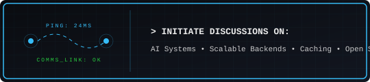

  

## --> About Me

Engineering student at **The National Institute of Engineering, Mysuru** (Information Science & Engineering, 2024-2028).
 
I build production-level systems, not toy projects. [NIEdge](https://niedge.vercel.app) is a student academic resource platform with real traction with **1.1K+ total users, 27K+ views**. [AlphaEngineX](https://alphaenginex.vercel.app) *(currently under development)* is a full-stack stock market simulator engineered for scale with atomic MongoDB transactions, UUIDv4 idempotency for race-condition-safe order processing, demand-driven volatility modeling across 15 companies in 5 sectors, APScheduler-based 30s price updates, per-user rate limiting, admin audit trails, and a 7-collection schema designed for production.
 
My focus right now: backend architecture depth, real-time systems, and AI integration.

---

## --> Engineering Principles

*   **Production over prototypes** - Building software designed to run and scale in the real world.
*   **Scalability first** - Designing database and caching layers that handle high concurrency.
*   **Clean architecture** - Modular, readable, and highly maintainable codebases.
*   **Performance conscious** - Minimizing latencies, optimizing queries, and leveraging caching.
*   **User-centric design** - Tailoring performance to provide an instantaneous user experience.

---

## --> Featured Systems

<table width="100%" border="0">
  <tr>
    <td width="50%" valign="top">
      <h4>🚀 <a href="https://niedge.vercel.app">NIEdge</a> - Academic Resource Engine</h4>
      
<b>Purpose:</b> High-traction student academic resource platform.

      
<b>Architecture:</b> Next.js + React + Tailwind CSS + Firebase

      <ul>
        <li>✓ <b>1.1K+ active users</b> & <b>27K+ total views</b>.</li>
        <li>✓ Fully search-optimized and responsive layout.</li>
        <li>✓ Multitenant architecture with role-based access.</li>
      </ul>
    </td>
    <td width="50%" valign="top">
      <h4>📈 <a href="https://alphaenginex.vercel.app">AlphaEngineX</a> - Volatility Simulator</h4>
      
<b>Purpose:</b> Institution-grade stock market simulator built for concurrency.

      
<b>Architecture:</b> React + FastAPI + Redis + MongoDB + Docker

      <ul>
        <li>✓ <b>Atomic MongoDB transactions</b> for race-condition-safe orders.</li>
        <li>✓ <b>UUIDv4 idempotency keys</b> protecting transaction pipelines.</li>
        <li>✓ <b>APScheduler price updates</b> refreshing volatility every 30s.</li>
      </ul>
    </td>
  </tr>
</table>

---

## --> Engineering Stack

<!-- Languages -->

  
  
  
  

<!-- Frameworks -->

  
  
  
  
  
  
  

<!-- Databases -->

  
  
  
  
  
  

<!-- DevOps & Hosting -->

  
  
  
  
  
  
  
  

---

## --> Performance Metrics

  

---

## --> Contact & Discussion

<table width="100%" border="0">
  <tr>
    <td width="65%" valign="middle">
      
    </td>
    <td width="35%" align="right" valign="middle">
      
        
      
        
      
    </td>
  </tr>
</table>
